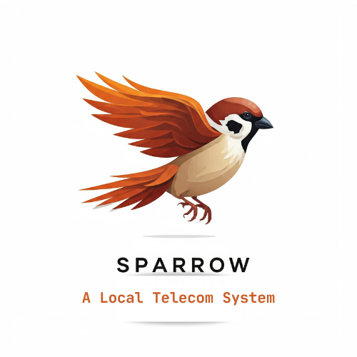

[](https://github.com/Arison99/Sparrow/actions)
[](https://github.com/Arison99/Sparrow/releases)
[](https://github.com/Arison99/Sparrow/stargazers)
[](https://github.com/Arison99/Sparrow/network/members)
[](https://github.com/Arison99/Sparrow/commits)
[](https://github.com/Arison99/Sparrow/issues)
[](https://www.java.com/)
[](https://spring.io/projects/spring-boot)


## Sparrow - A Telecommunication System



Sparrow is a comprehensive telecommunications system designed to handle modern voice and video communication, mobile money transactions, and SMS services. Built with Java and Spring Boot, Sparrow provides a robust backend to manage the complexities of real-time communication, including WebRTC signaling for peer-to-peer connections. Sparrow can be integrated into your WebApps to understand how Payment systems work, video calls, VOIP, SMS and Calls. 
    Sparrow is designed using Java and it's part of the Projects am currently undertaking.
Feel free to test the software & provide some feedback.

## Features:

**Voice and Video Calls**: Enable high-quality voice and video calls with WebRTC support for real-time communication.

**Mobile Money**: Secure transactions for mobile money services, allowing users to send and receive payments seamlessly.

**SMS Service**: Simple, reliable SMS service for sending and receiving text messages.

**Real-Time Signaling**: WebSocket-based signaling system for initiating and managing WebRTC connections.


**Technologies Used**:

- Java 17
- Spring Boot
- WebRTC
- WebSocket
- JUnit for testing


This project is ideal for anyone interested in building a scalable and modular telecommunication system with both backend and real-time frontend features.

## Getting Started

### Prerequisites

- Java 11 or higher
- Maven 3.6.3 or higher

### Installation

1. Clone the repository:
    ```sh
    git clone https://github.com/Arison99/Sparrow.git
    cd Sparrow
    ```

2. Build the project:
    ```sh
    mvn clean install
    ```

3. Run the application:
    ```sh
    mvn spring-boot:run
    ```

## Usage

### API Endpoints

- **Start Call**: `POST /api/call/start`
- **End Call**: `POST /api/call/end`
- **Send SMS**: `POST /api/sms/send`
- **Mobile Money Transfer**: `POST /api/mobile-money/transfer`

### Example Requests

#### Start Call
```sh
curl -X POST "http://localhost:8080/api/call/start" -d "caller=user1&callee=user2"
```
### End Call
```sh
curl -X POST "http://localhost:8080/api/call/end" -d "callId=1"
```
### Running Tests
To run the tests, use the following command:
```sh
  mvn test
```

### Contributing
- Contributions are welcome! Please read the CONTRIBUTING.md for guidelines.

### License
This project is licensed under the MIT License - see the LICENSE file for details.

Acknowledgements
Spring Boot
Maven

### Contact
- For any inquiries, please contact
### Arison99.


